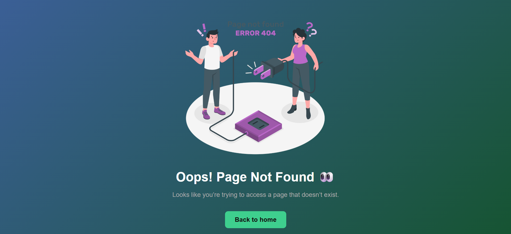

# Custom 404 Page

A clean and responsive custom 404 error page built using HTML and CSS.

## 🚀 Features

* Responsive design for mobile and desktop
* Centered layout using Flexbox
* Modern gradient background
* Styled call-to-action button with hover effect
* Clean and minimal UI

## 🛠️ Tech Stack

* HTML5
* CSS3 (Flexbox, Media Queries)

## 📂 Project Structure

* `index.html` – Main structure of the page
* `style.css` – Styling and layout
* `404.png` – Illustration image

## 📂 How to Use

1. Clone the repository
2. Open `index.html` in your browser

## 📸 Preview

## 🌍 Live Demo

🔗 [Click here to view the live 404 page](https://custom-404-page.netlify.app/)

## 📌 Author

Abhijit Peringadan
